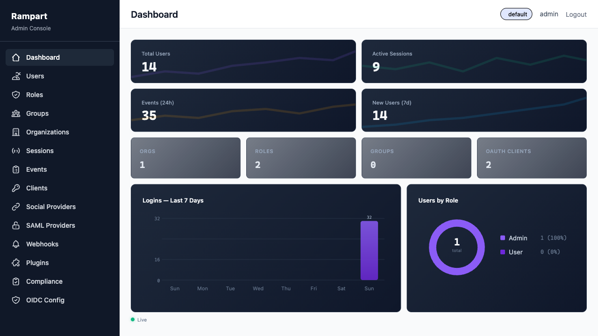
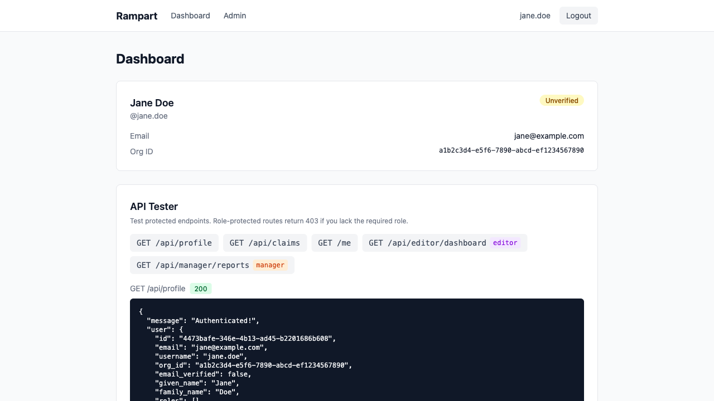
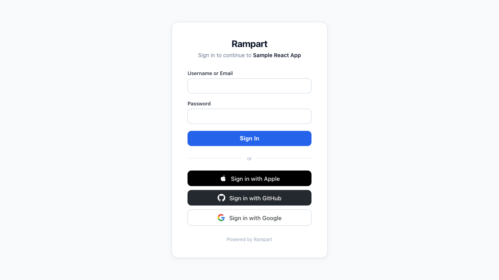
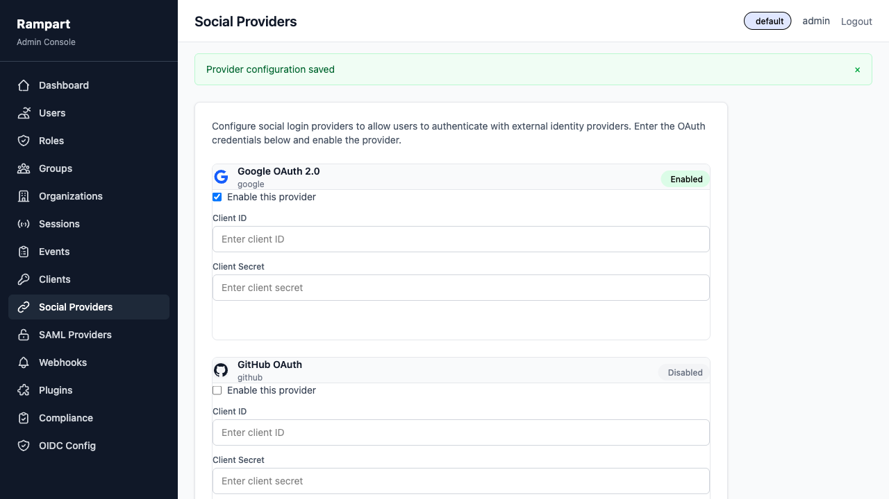

<p align="center">
  
</p>

<h1 align="center">Rampart</h1>

<p align="center">
  <strong>Open-source Identity & Access Management for modern applications.</strong><br />
  A single Go binary. Deploy in seconds. Own your auth forever.
</p>

<p align="center">
  <a href="https://github.com/manimovassagh/rampart/actions/workflows/ci.yml"></a>
  <a href="https://github.com/manimovassagh/rampart/actions/workflows/security.yml"></a>
  <a href="https://github.com/manimovassagh/rampart/releases/latest"></a>
  
  <a href="https://github.com/manimovassagh/rampart/blob/main/LICENSE"></a>
  <a href="https://manimovassagh.github.io/rampart/"></a>
</p>

---

## Features

<table>
<tr>
<td width="25%" valign="top"><strong>OAuth 2.0 + PKCE</strong><br /><sub>Authorization Code, Client Credentials, Device Flow. PKCE enforced by default.</sub></td>
<td width="25%" valign="top"><strong>OpenID Connect</strong><br /><sub>Full OIDC provider with discovery, JWKS, ID tokens, and UserInfo endpoint.</sub></td>
<td width="25%" valign="top"><strong>Multi-Tenant</strong><br /><sub>Native org_id scoping. Isolate users, roles, and clients per organization.</sub></td>
<td width="25%" valign="top"><strong>RBAC</strong><br /><sub>Role-based access control with groups, scopes, and fine-grained permissions.</sub></td>
</tr>
<tr>
<td width="25%" valign="top"><strong>MFA</strong><br /><sub>TOTP, WebAuthn/passkeys, hardware keys, and backup codes.</sub></td>
<td width="25%" valign="top"><strong>Social Login</strong><br /><sub>Google, GitHub, Apple. One-click sign-in with automatic account linking.</sub></td>
<td width="25%" valign="top"><strong>SAML 2.0</strong><br /><sub>Service Provider bridge for enterprise single sign-on.</sub></td>
<td width="25%" valign="top"><strong>Webhooks</strong><br /><sub>HMAC-signed event delivery for user lifecycle, login, and audit events.</sub></td>
</tr>
<tr>
<td width="25%" valign="top"><strong>Admin Console</strong><br /><sub>Built-in dashboard with real-time SSE. Manage users, apps, roles, and logs.</sub></td>
<td width="25%" valign="top"><strong>Observability</strong><br /><sub>Prometheus metrics, structured audit logging, and compliance dashboards.</sub></td>
<td width="25%" valign="top"><strong>AI-Ready</strong><br /><sub>Ship auth in 30 seconds. AI integration skill for Claude, Copilot, and Cursor.</sub></td>
<td width="25%" valign="top"><strong>Security Hardened</strong><br /><sub>Refresh token rotation, CSRF protection, rate limiting, HSTS, encryption at rest.</sub></td>
</tr>
</table>

---

## Screenshots

<table>
<tr>
<td width="50%" align="center">
<strong>Admin Dashboard</strong><br />
<sub>Real-time metrics, login charts, role distribution, and live SSE updates.</sub><br /><br />

</td>
<td width="50%" align="center">
<strong>React SDK Integration</strong><br />
<sub>User card, API tester, and role-based access control in action.</sub><br /><br />

</td>
</tr>
<tr>
<td width="50%" align="center">
<strong>Login Page</strong><br />
<sub>Clean, branded sign-in form. Works with any OAuth client.</sub><br /><br />

</td>
<td width="50%" align="center">
<strong>Social Login</strong><br />
<sub>Google, GitHub, and Apple sign-in. One-click config in the admin console.</sub><br /><br />

</td>
</tr>
</table>

---

## Official SDKs

15 adapters covering every major stack. Drop-in middleware and client libraries.

### Backend

| Adapter | Package | Registry |
|---------|---------|----------|
| **Node.js** | `@rampart-auth/node` | [](https://www.npmjs.com/package/@rampart-auth/node) |
| **Go** | `github.com/manimovassagh/rampart/adapters/backend/go` | [](https://pkg.go.dev/github.com/manimovassagh/rampart/adapters/backend/go) |
| **Python** | `rampart-python` | [](https://pypi.org/project/rampart-python/) |
| **Spring Boot** | `rampart-spring-boot-starter` | [](https://central.sonatype.com/artifact/io.github.manimovassagh/rampart-spring-boot-starter) |
| **.NET** | `Rampart.AspNetCore` | [](https://www.nuget.org/packages/Rampart.AspNetCore) |
| **Ruby** | `rampart-ruby` | [](https://rubygems.org/gems/rampart-ruby) |
| **PHP** | `rampart/laravel` | [](https://packagist.org/packages/rampart/laravel) |
| **Rust** | `rampart-rust` | [](https://crates.io/crates/rampart-rust) |

### Frontend

| Adapter | Package | Registry |
|---------|---------|----------|
| **Web** (vanilla JS/TS) | `@rampart-auth/web` | [](https://www.npmjs.com/package/@rampart-auth/web) |
| **React** | `@rampart-auth/react` | [](https://www.npmjs.com/package/@rampart-auth/react) |
| **Next.js** | `@rampart-auth/nextjs` | [](https://www.npmjs.com/package/@rampart-auth/nextjs) |
| **React Native** | `@rampart-auth/react-native` | [](https://www.npmjs.com/package/@rampart-auth/react-native) |
| **Flutter** | `rampart_flutter` | [](https://pub.dev/packages/rampart_flutter) |
| **Swift/iOS** | `Rampart` | [](https://github.com/manimovassagh/rampart-swift) |
| **Kotlin** | `com.rampart` | [](https://central.sonatype.com/artifact/com.rampart/rampart-kotlin) |

---

## Quick Start

### Docker Compose -- up and running in 30 seconds

```bash
git clone https://github.com/manimovassagh/rampart.git
cd rampart
docker compose up -d --build
```

Admin console: **http://localhost:8080/admin/**

### From Source

```bash
go build ./cmd/rampart
./rampart
```

### Verify it works

```bash
# OIDC discovery
curl http://localhost:8080/.well-known/openid-configuration

# Register a user
curl -X POST http://localhost:8080/register \
  -H 'Content-Type: application/json' \
  -d '{"email": "user@example.com", "password": "S3cure!Pass"}'

# Login and receive tokens
curl -X POST http://localhost:8080/login \
  -H 'Content-Type: application/json' \
  -d '{"email": "user@example.com", "password": "S3cure!Pass"}'
```

---

## Cookbook

The [`cookbook/`](cookbook/) directory contains a working integration example for every adapter:

| Sample | Stack | Description |
|--------|-------|-------------|
| [express-backend](cookbook/express-backend/) | Node + Express | JWT verification via `@rampart-auth/node` |
| [go-backend](cookbook/go-backend/) | Go + net/http | JWT verification via Rampart Go middleware |
| [fastapi-backend](cookbook/fastapi-backend/) | Python + FastAPI | JWT verification via `rampart-python` |
| [spring-backend](cookbook/spring-backend/) | Java + Spring Boot | Spring Security OAuth2 Resource Server |
| [dotnet-backend](cookbook/dotnet-backend/) | C# + ASP.NET Core | JWT Bearer via `Rampart.AspNetCore` |
| [react-app](cookbook/react-app/) | React | SPA with auth, routing, and RBAC |
| [web-frontend](cookbook/web-frontend/) | Vanilla TS | OAuth PKCE flow via `@rampart-auth/web` |
| [ruby-backend](cookbook/ruby-backend/) | Ruby + Sinatra | JWT verification via `rampart-ruby` |
| [php-backend](cookbook/php-backend/) | PHP + Laravel | JWT verification via `rampart/laravel` |
| [rust-backend](cookbook/rust-backend/) | Rust + Actix Web | JWT verification via `rampart-rust` |

---

## Architecture

Rampart is a self-contained identity server built on proven foundations:

- **Go** -- single statically-linked binary, no runtime dependencies
- **PostgreSQL** -- sole data store for users, sessions, clients, and keys
- **RS256 JWT** -- asymmetric signing with automatic key generation and JWKS publishing
- **Server-side admin UI** -- Go templates, htmx, Tailwind CSS -- no separate SPA to deploy

No Redis. No message brokers. No external caches. One binary, one database.

---

## Security

- PKCE mandatory on all public OAuth clients
- Refresh token rotation with automatic reuse detection
- Per-endpoint rate limiting (login, register, token)
- HSTS, secure cookies, and CSRF protection
- Encryption at rest for secrets and signing keys
- Automated security scanning via gosec and govulncheck in CI
- HMAC-signed webhook payloads

Report vulnerabilities to **security@rampart.dev** or open a [GitHub Security Advisory](https://github.com/manimovassagh/rampart/security/advisories).

---

## AI-Ready Integration

Rampart is designed for the AI-first development era. Every adapter can be implemented by AI coding assistants in under 30 seconds.

- **AI Integration Skill** -- `.github/copilot-instructions.md` provides decision trees, minimal code patterns, and common pitfalls for Claude, Copilot, Cursor, and Windsurf
- **Copy-paste Quick Start** -- every adapter README contains working code that AI assistants can paste directly into your project
- **Consistent API** -- all 8 backend adapters share the same JWT claims structure and error format, so switching stacks requires zero auth redesign
- **Typed SDKs** -- TypeScript, Go structs, Python dataclasses, C# classes, and Java POJOs provide full autocomplete and type safety in any AI-assisted IDE

```
# Ask any AI assistant:
"Add Rampart authentication to my Express app"
"Protect my FastAPI endpoints with Rampart JWT verification"
"Set up OAuth PKCE login in my React app with Rampart"
```

---

## Development

```bash
go test ./...          # Run all tests
golangci-lint run      # Lint
make check             # Full quality gate (lint + vet + test + security)
```

CI runs on every push: build, test, lint, security scanning, Docker build, and documentation deployment.

---

## Contributing

Contributions are welcome. See [CONTRIBUTING.md](CONTRIBUTING.md) for guidelines.

1. Fork the repository
2. Create a feature branch
3. Submit a Pull Request

---

## License

Rampart is licensed under the [GNU Affero General Public License v3.0](LICENSE).

Full documentation at **[manimovassagh.github.io/rampart](https://manimovassagh.github.io/rampart/)**
