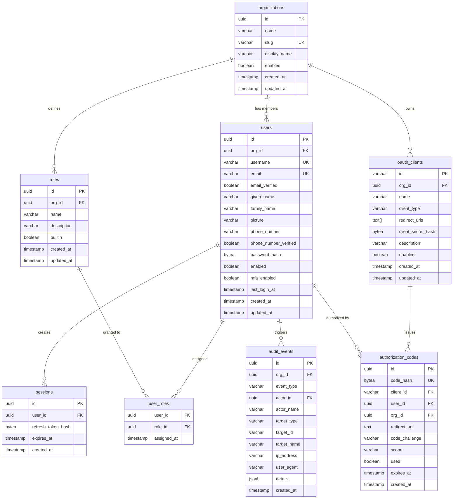

# Data Model

Rampart uses PostgreSQL as its primary data store. The schema is designed for multi-tenancy, auditability, and flexibility without sacrificing query performance.

## Entity-Relationship Diagram



## Table Descriptions

### organizations

The top-level tenant boundary. All users, roles, clients, and policies are scoped to an organization. A single Rampart instance can host many organizations with full data isolation.

| Column | Type | Notes |
|--------|------|-------|
| `id` | `uuid` | Primary key, generated server-side |
| `name` | `varchar(255)` | Internal name |
| `slug` | `varchar(255)` | URL-safe identifier, unique across the instance |
| `display_name` | `varchar(255)` | Human-readable display name |
| `enabled` | `boolean` | Soft disable without deletion (default: `true`) |
| `created_at` | `timestamptz` | Row creation time |
| `updated_at` | `timestamptz` | Last modification time |

### users

User accounts scoped to an organization. Email and username are unique within an organization (enforced via composite unique indexes).

| Column | Type | Notes |
|--------|------|-------|
| `id` | `uuid` | Primary key |
| `org_id` | `uuid` | FK to `organizations.id` |
| `username` | `varchar(255)` | Unique per org |
| `email` | `varchar(255)` | Unique per org |
| `email_verified` | `boolean` | Defaults to `false` |
| `given_name` | `varchar(255)` | Optional (OIDC standard claim) |
| `family_name` | `varchar(255)` | Optional (OIDC standard claim) |
| `picture` | `varchar(2048)` | Profile picture URL |
| `phone_number` | `varchar(50)` | Optional |
| `phone_number_verified` | `boolean` | Defaults to `false` |
| `password_hash` | `bytea` | argon2id hash (PHC format), nullable for social-only accounts |
| `enabled` | `boolean` | Soft disable without deletion (default: `true`) |
| `mfa_enabled` | `boolean` | Whether MFA is active for this user (default: `false`) |
| `last_login_at` | `timestamptz` | Updated on successful authentication |
| `created_at` | `timestamptz` | Row creation time |
| `updated_at` | `timestamptz` | Last modification time |

### roles

Named roles scoped to an organization. Supports a `builtin` flag for system-defined roles (e.g., `admin`, `member`) that cannot be deleted.

| Column | Type | Notes |
|--------|------|-------|
| `id` | `uuid` | Primary key |
| `org_id` | `uuid` | FK to `organizations.id` |
| `name` | `varchar(100)` | Unique per organization |
| `description` | `varchar(500)` | Human-readable description |
| `builtin` | `boolean` | System-defined role (default: `false`) |
| `created_at` | `timestamptz` | Row creation time |
| `updated_at` | `timestamptz` | Last modification time |

### user_roles

Join table between users and roles. Uses a composite primary key on `(user_id, role_id)` to prevent duplicate assignments.

| Column | Type | Notes |
|--------|------|-------|
| `user_id` | `uuid` | FK to `users.id` (part of composite PK) |
| `role_id` | `uuid` | FK to `roles.id` (part of composite PK) |
| `assigned_at` | `timestamptz` | When the role was assigned (default: `now()`) |

### oauth_clients

Registered OAuth 2.0 / OIDC clients (relying parties). Each client belongs to an organization. The `id` column serves as both the internal primary key and the public `client_id`.

| Column | Type | Notes |
|--------|------|-------|
| `id` | `varchar(128)` | Primary key and public client identifier |
| `org_id` | `uuid` | FK to `organizations.id` |
| `name` | `varchar(255)` | Display name |
| `client_type` | `varchar(20)` | `public` or `confidential` |
| `redirect_uris` | `text[]` | Allowed redirect URIs (exact match, no wildcards) |
| `client_secret_hash` | `bytea` | bcrypt hash of client secret (confidential clients only) |
| `description` | `varchar(500)` | Optional description |
| `enabled` | `boolean` | Soft disable without deletion (default: `true`) |
| `created_at` | `timestamptz` | Row creation time |
| `updated_at` | `timestamptz` | Last modification time |

### sessions

Active user sessions. Each session stores a hashed refresh token. Refresh tokens are not stored in a separate table; they are a column on the sessions table.

| Column | Type | Notes |
|--------|------|-------|
| `id` | `uuid` | Primary key |
| `user_id` | `uuid` | FK to `users.id` |
| `refresh_token_hash` | `bytea` | SHA-256 hash of the refresh token |
| `expires_at` | `timestamptz` | Session expiration |
| `created_at` | `timestamptz` | Session creation time |

### audit_events

Append-only log of security-relevant events. This table is insert-only in normal operation; rows are never updated or deleted.

| Column | Type | Notes |
|--------|------|-------|
| `id` | `uuid` | Primary key |
| `org_id` | `uuid` | FK to `organizations.id` |
| `event_type` | `varchar(50)` | Event category (e.g., `user.login`, `user.login_failed`, `role.assigned`) |
| `actor_id` | `uuid` | FK to `users.id` (nullable for anonymous events) |
| `actor_name` | `varchar(255)` | Display name of the actor at event time |
| `target_type` | `varchar(50)` | Type of the affected entity (e.g., `user`, `role`, `client`) |
| `target_id` | `varchar(255)` | ID of the affected entity |
| `target_name` | `varchar(255)` | Display name of the affected entity |
| `ip_address` | `varchar(45)` | Source IP address |
| `user_agent` | `varchar(500)` | Client user agent |
| `details` | `jsonb` | Event-specific payload (changed fields, error reasons, etc.) |
| `created_at` | `timestamptz` | Event timestamp (immutable) |

Indexed on `(org_id, created_at DESC)` for efficient filtering and time-range queries, plus indexes on `event_type` and `actor_id`.

### authorization_codes

Short-lived authorization codes issued during the OAuth 2.0 authorization code flow. Codes are single-use and expire within minutes.

| Column | Type | Notes |
|--------|------|-------|
| `id` | `uuid` | Primary key |
| `code_hash` | `bytea` | SHA-256 hash of the authorization code (unique) |
| `client_id` | `varchar(128)` | FK to `oauth_clients.id` |
| `user_id` | `uuid` | FK to `users.id` |
| `org_id` | `uuid` | FK to `organizations.id` |
| `redirect_uri` | `text` | The redirect URI used in the authorization request |
| `code_challenge` | `varchar(128)` | PKCE code challenge |
| `scope` | `varchar(512)` | Granted scopes (default: `openid`) |
| `used` | `boolean` | Set to `true` on exchange; prevents replay |
| `expires_at` | `timestamptz` | Typically 10 minutes from issuance |
| `created_at` | `timestamptz` | Issuance time |

## JSONB Usage

The `audit_events.details` column uses `jsonb` for extensibility without schema migrations. Event-specific payloads vary by event type, and JSONB keeps the audit table schema stable while supporting rich event data.

### Querying JSONB

```sql
-- Find audit events with a specific detail
SELECT * FROM audit_events
WHERE org_id = $1
  AND details->>'reason' = 'brute_force';
```

## Indexing Strategy

Key indexes beyond primary keys:

| Table | Index | Purpose |
|-------|-------|---------|
| `users` | `(email, org_id)` UNIQUE | Email uniqueness per org |
| `users` | `(username, org_id)` UNIQUE | Username uniqueness per org |
| `users` | `(org_id)` | List users by organization |
| `user_roles` | `(user_id, role_id)` PK | Composite primary key prevents duplicates |
| `user_roles` | `(role_id)` | Reverse lookup: users with a given role |
| `roles` | `(name, org_id)` UNIQUE | Role name uniqueness per org |
| `oauth_clients` | `(org_id)` | List clients by organization |
| `oauth_clients` | `(org_id, enabled)` | Filter active clients per org |
| `sessions` | `(user_id)` | List user sessions |
| `sessions` | `(expires_at)` | Expired session cleanup |
| `audit_events` | `(org_id, created_at DESC)` | Filtered audit queries |
| `audit_events` | `(event_type)` | Filter by event type |
| `audit_events` | `(actor_id)` | Per-user audit history |
| `authorization_codes` | `(code_hash)` UNIQUE | Code exchange lookup |
| `authorization_codes` | `(expires_at)` | Expired code cleanup |

## Data Lifecycle

| Data Type | Retention | Cleanup |
|-----------|-----------|---------|
| Auth codes | 10 minutes | Background job purges expired codes |
| Sessions | Configurable (default 24h) | Expired sessions cleaned by background job |
| Audit events | Configurable (default 90 days) | Archival or deletion based on retention policy |
| User data | Until deletion | Soft-delete via `enabled` flag |
