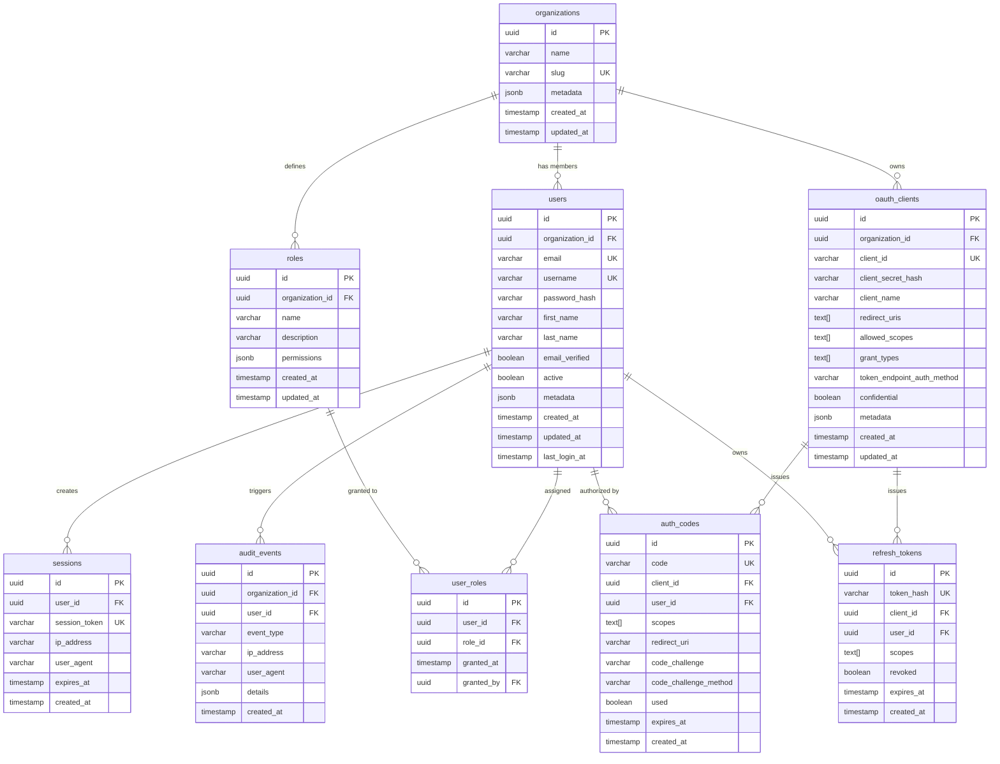

# Data Model

Rampart uses PostgreSQL as its primary data store. The schema is designed for multi-tenancy, auditability, and flexibility without sacrificing query performance.

## Entity-Relationship Diagram



## Table Descriptions

### organizations

The top-level tenant boundary. All users, roles, clients, and policies are scoped to an organization. A single Rampart instance can host many organizations with full data isolation.

| Column | Type | Notes |
|--------|------|-------|
| `id` | `uuid` | Primary key, generated server-side |
| `name` | `varchar(255)` | Display name |
| `slug` | `varchar(100)` | URL-safe identifier, unique across the instance |
| `metadata` | `jsonb` | Extensible key-value data (theme, branding, config overrides) |
| `created_at` | `timestamptz` | Row creation time |
| `updated_at` | `timestamptz` | Last modification time |

### users

User accounts scoped to an organization. Email and username are unique within an organization (enforced via composite unique indexes).

| Column | Type | Notes |
|--------|------|-------|
| `id` | `uuid` | Primary key |
| `organization_id` | `uuid` | FK to `organizations.id` |
| `email` | `varchar(320)` | RFC 5321 max length |
| `username` | `varchar(100)` | Optional, unique per org |
| `password_hash` | `varchar(255)` | bcrypt hash, never exposed via API |
| `first_name` | `varchar(100)` | Optional |
| `last_name` | `varchar(100)` | Optional |
| `email_verified` | `boolean` | Defaults to `false` |
| `active` | `boolean` | Soft disable without deletion |
| `metadata` | `jsonb` | Custom attributes (department, employee_id, etc.) |
| `created_at` | `timestamptz` | Row creation time |
| `updated_at` | `timestamptz` | Last modification time |
| `last_login_at` | `timestamptz` | Updated on successful authentication |

### roles

Named roles with a set of permissions, scoped to an organization. Permissions are stored as a JSONB array of permission strings.

| Column | Type | Notes |
|--------|------|-------|
| `id` | `uuid` | Primary key |
| `organization_id` | `uuid` | FK to `organizations.id` |
| `name` | `varchar(100)` | Unique per organization |
| `description` | `varchar(500)` | Human-readable description |
| `permissions` | `jsonb` | Array of permission strings, e.g. `["users:read", "users:write"]` |
| `created_at` | `timestamptz` | Row creation time |
| `updated_at` | `timestamptz` | Last modification time |

### user_roles

Join table between users and roles. Tracks who granted the role and when.

| Column | Type | Notes |
|--------|------|-------|
| `id` | `uuid` | Primary key |
| `user_id` | `uuid` | FK to `users.id` |
| `role_id` | `uuid` | FK to `roles.id` |
| `granted_at` | `timestamptz` | When the role was assigned |
| `granted_by` | `uuid` | FK to `users.id` (the admin who granted it) |

Composite unique constraint on `(user_id, role_id)` prevents duplicate assignments.

### oauth_clients

Registered OAuth 2.0 / OIDC clients (relying parties). Each client belongs to an organization.

| Column | Type | Notes |
|--------|------|-------|
| `id` | `uuid` | Internal primary key |
| `organization_id` | `uuid` | FK to `organizations.id` |
| `client_id` | `varchar(100)` | Public client identifier, globally unique |
| `client_secret_hash` | `varchar(255)` | bcrypt hash of client secret (confidential clients only) |
| `client_name` | `varchar(255)` | Display name |
| `redirect_uris` | `text[]` | Allowed redirect URIs (exact match, no wildcards) |
| `allowed_scopes` | `text[]` | Scopes this client is allowed to request |
| `grant_types` | `text[]` | Allowed grant types (authorization_code, client_credentials, etc.) |
| `token_endpoint_auth_method` | `varchar(50)` | `client_secret_basic`, `client_secret_post`, or `none` |
| `confidential` | `boolean` | Whether the client can keep a secret |
| `metadata` | `jsonb` | Additional client configuration |
| `created_at` | `timestamptz` | Row creation time |
| `updated_at` | `timestamptz` | Last modification time |

### sessions

Active user sessions. Session tokens are stored as hashes. The actual session data (user context, CSRF tokens) lives in Redis for fast access; this table provides a persistent record for audit and management.

| Column | Type | Notes |
|--------|------|-------|
| `id` | `uuid` | Primary key |
| `user_id` | `uuid` | FK to `users.id` |
| `session_token` | `varchar(255)` | SHA-256 hash of the session token |
| `ip_address` | `varchar(45)` | Client IP (IPv4 or IPv6) |
| `user_agent` | `varchar(500)` | Client user agent string |
| `expires_at` | `timestamptz` | Session expiration |
| `created_at` | `timestamptz` | Session creation time |

### audit_events

Append-only log of security-relevant events. This table is insert-only in normal operation; rows are never updated or deleted.

| Column | Type | Notes |
|--------|------|-------|
| `id` | `uuid` | Primary key |
| `organization_id` | `uuid` | FK to `organizations.id` |
| `user_id` | `uuid` | FK to `users.id` (nullable for anonymous events) |
| `event_type` | `varchar(100)` | Event category (e.g., `user.login`, `user.login_failed`, `role.assigned`) |
| `ip_address` | `varchar(45)` | Source IP address |
| `user_agent` | `varchar(500)` | Client user agent |
| `details` | `jsonb` | Event-specific payload (changed fields, error reasons, etc.) |
| `created_at` | `timestamptz` | Event timestamp (immutable) |

Indexed on `(organization_id, event_type, created_at)` for efficient filtering and time-range queries.

### auth_codes

Short-lived authorization codes issued during the OAuth 2.0 authorization code flow. Codes are single-use and expire within minutes.

| Column | Type | Notes |
|--------|------|-------|
| `id` | `uuid` | Primary key |
| `code` | `varchar(255)` | The authorization code (hashed) |
| `client_id` | `uuid` | FK to `oauth_clients.id` |
| `user_id` | `uuid` | FK to `users.id` |
| `scopes` | `text[]` | Granted scopes |
| `redirect_uri` | `text` | The redirect URI used in the authorization request |
| `code_challenge` | `varchar(255)` | PKCE code challenge |
| `code_challenge_method` | `varchar(10)` | `S256` (plain is not supported) |
| `used` | `boolean` | Set to `true` on exchange; prevents replay |
| `expires_at` | `timestamptz` | Typically 10 minutes from issuance |
| `created_at` | `timestamptz` | Issuance time |

### refresh_tokens

Long-lived refresh tokens. Stored as hashes, never in plaintext. Support revocation for logout and security incident response.

| Column | Type | Notes |
|--------|------|-------|
| `id` | `uuid` | Primary key |
| `token_hash` | `varchar(255)` | SHA-256 hash of the refresh token |
| `client_id` | `uuid` | FK to `oauth_clients.id` |
| `user_id` | `uuid` | FK to `users.id` |
| `scopes` | `text[]` | Scopes associated with this token |
| `revoked` | `boolean` | Set to `true` on revocation |
| `expires_at` | `timestamptz` | Token expiration (configurable, typically 30 days) |
| `created_at` | `timestamptz` | Issuance time |

## JSONB Usage

Several tables use `jsonb` columns for extensibility without schema migrations:

- **`organizations.metadata`** — Theme configuration, branding assets, feature flags, custom settings per tenant.
- **`users.metadata`** — Custom user attributes that vary by organization (employee ID, department, cost center). Avoids the EAV anti-pattern while keeping the schema stable.
- **`roles.permissions`** — Permission arrays stored as JSONB for flexible, queryable permission models. Supports PostgreSQL's `@>` containment operator for efficient permission checks.
- **`oauth_clients.metadata`** — Client-specific configuration overrides (token lifetimes, custom claims).
- **`audit_events.details`** — Event-specific payloads that vary by event type. Keeps the audit table schema stable while supporting rich event data.

### Querying JSONB

```sql
-- Find users with a specific department
SELECT * FROM users
WHERE organization_id = $1
  AND metadata->>'department' = 'engineering';

-- Check if a role has a specific permission
SELECT * FROM roles
WHERE organization_id = $1
  AND permissions @> '["users:write"]';
```

## Indexing Strategy

Key indexes beyond primary keys:

| Table | Index | Purpose |
|-------|-------|---------|
| `users` | `(organization_id, email)` UNIQUE | Email uniqueness per org |
| `users` | `(organization_id, username)` UNIQUE | Username uniqueness per org |
| `user_roles` | `(user_id, role_id)` UNIQUE | Prevent duplicate assignments |
| `oauth_clients` | `(client_id)` UNIQUE | Global client ID lookup |
| `sessions` | `(session_token)` UNIQUE | Fast session validation |
| `sessions` | `(user_id)` | List user sessions |
| `audit_events` | `(organization_id, event_type, created_at)` | Filtered audit queries |
| `audit_events` | `(user_id, created_at)` | Per-user audit history |
| `auth_codes` | `(code)` UNIQUE | Code exchange lookup |
| `refresh_tokens` | `(token_hash)` UNIQUE | Token validation |

## Data Lifecycle

| Data Type | Retention | Cleanup |
|-----------|-----------|---------|
| Auth codes | 10 minutes | Background job purges expired codes |
| Sessions | Configurable (default 24h) | Expired sessions cleaned by background job + Redis TTL |
| Refresh tokens | Configurable (default 30 days) | Revoked and expired tokens purged periodically |
| Audit events | Configurable (default 90 days) | Archival or deletion based on retention policy |
| User data | Until deletion | Soft-delete with configurable hard-delete grace period |
