# Component Diagram (C4 Level 2)

Internal architecture of the Rampart server.

```mermaid
C4Container
    title Rampart Server — Internal Components

    Person(user, "End User / Admin")
    System_Ext(clientApp, "Client Application")

    Container_Boundary(rampart, "Rampart Server (Go binary)") {
        Component(httpRouter, "HTTP Router", "chi", "Routes requests, middleware chain (CORS, rate limit, request ID, logging)")
        Component(oauthEngine, "OAuth 2.0 Engine", "Go", "Authorization Code, Client Credentials, Device Flow, PKCE validation, token issuance")
        Component(oidcLayer, "OIDC Layer", "Go", "ID token generation, discovery, userinfo, JWKS, session management")
        Component(adminAPI, "Admin API", "Go", "CRUD for organizations, users, clients, roles, groups, IdPs")
        Component(accountAPI, "Account API", "Go", "Self-service profile, password, sessions, MFA enrollment")
        Component(authN, "Authentication Engine", "Go", "Password verification, social login, SAML, MFA challenge")
        Component(mfaEngine, "MFA Engine", "Go", "TOTP generation/validation, WebAuthn, recovery codes")
        Component(rbacEngine, "RBAC Engine", "Go", "Role resolution, permission checks, group-role inheritance")
        Component(sessionMgr, "Session Manager", "Go", "Session lifecycle, token blacklisting, concurrent session control")
        Component(userStore, "User Store", "Go", "User CRUD, password hashing (argon2id), profile management")
        Component(eventBus, "Event Bus", "Go", "Audit logging, webhook dispatch, async event processing")
        Component(cryptoModule, "Crypto Module", "Go", "JWK management, key rotation, JWT signing/verification")
        Component(pluginSystem, "Plugin System", "Go", "Extension points for custom auth, claims, events (future)")
    }

    ContainerDb(postgres, "PostgreSQL", "Primary Store", "Users, clients, roles, tokens, events, organizations")
    ContainerDb(redis, "Redis / Valkey", "Cache", "Sessions, token blacklist, rate limit counters, PKCE challenges")

    System_Ext(externalIdP, "External IdP", "Google, GitHub, SAML providers")
    System_Ext(emailSvc, "Email Service", "Verification, password reset")

    Rel(user, httpRouter, "HTTPS")
    Rel(clientApp, httpRouter, "HTTPS")

    Rel(httpRouter, oauthEngine, "OAuth endpoints")
    Rel(httpRouter, oidcLayer, "OIDC endpoints")
    Rel(httpRouter, adminAPI, "Admin endpoints")
    Rel(httpRouter, accountAPI, "Account endpoints")

    Rel(oauthEngine, authN, "Validates credentials")
    Rel(oauthEngine, cryptoModule, "Signs tokens")
    Rel(oauthEngine, sessionMgr, "Creates sessions")

    Rel(oidcLayer, cryptoModule, "Signs ID tokens, serves JWKS")
    Rel(oidcLayer, userStore, "Fetches user claims")

    Rel(adminAPI, userStore, "Manages users")
    Rel(adminAPI, rbacEngine, "Manages roles/permissions")

    Rel(accountAPI, userStore, "Profile updates")
    Rel(accountAPI, mfaEngine, "MFA enrollment")

    Rel(authN, userStore, "Credential lookup")
    Rel(authN, mfaEngine, "MFA challenge")
    Rel(authN, externalIdP, "Social/SAML login")

    Rel(rbacEngine, postgres, "Role queries")
    Rel(userStore, postgres, "User data")
    Rel(sessionMgr, redis, "Session data")
    Rel(oauthEngine, redis, "PKCE challenges, auth codes")

    Rel(eventBus, postgres, "Persists audit events")
    Rel(authN, emailSvc, "Sends verification emails")
```

## Component Descriptions

### Request Pipeline

| Component | Responsibility |
|-----------|---------------|
| **HTTP Router** | Request routing, middleware chain (CORS, rate limiting, request ID injection, structured logging, panic recovery). Uses [chi](https://github.com/go-chi/chi) for lightweight, idiomatic Go routing. |
| **OAuth 2.0 Engine** | Implements RFC 6749 (Authorization Code, Client Credentials), RFC 7636 (PKCE), RFC 8628 (Device Flow), RFC 7009 (Revocation), RFC 7662 (Introspection). |
| **OIDC Layer** | Builds on top of the OAuth engine to add OpenID Connect — ID token generation, discovery document, userinfo endpoint, JWKS endpoint, RP-initiated logout. |
| **Admin API** | RESTful CRUD for all Rampart resources. Scoped to admin-level tokens. |
| **Account API** | Self-service endpoints for authenticated users. Scoped to the user's own data. |

### Core Engines

| Component | Responsibility |
|-----------|---------------|
| **Authentication Engine** | Validates user credentials (password, social login, SAML assertions). Orchestrates MFA challenges. Handles login session creation. |
| **MFA Engine** | TOTP secret generation, QR code creation, code validation, recovery code management. WebAuthn support planned. |
| **RBAC Engine** | Resolves effective permissions from direct role assignments and group-role inheritance. Supports permission checks at API level. |
| **Session Manager** | Session lifecycle (create, refresh, expire, revoke). Token blacklisting for revoked access tokens. Concurrent session limits per policy. |
| **User Store** | User CRUD operations, password hashing (argon2id with tuned parameters), email verification state, profile management. |

### Infrastructure

| Component | Responsibility |
|-----------|---------------|
| **Event Bus** | Records audit events (login, failed auth, permission changes) to PostgreSQL. Dispatches webhook notifications asynchronously. |
| **Crypto Module** | JWK generation and rotation, JWT signing (RS256, ES256), signature verification. Keys stored in DB, cached in memory. |
| **Plugin System** | Future extension points — custom authentication steps, custom claim mappers, event handlers. Architecture TBD (WASM vs gRPC vs Go-only). |

## Go Framework Decision

Rampart uses **Go standard library + chi router** rather than a full framework:

| Choice | Rationale |
|--------|-----------|
| **Go stdlib `net/http`** | Production-grade HTTP server with graceful shutdown, TLS, HTTP/2 built in. No framework overhead. |
| **chi router** | Lightweight, 100% compatible with `net/http`, context-based middleware, URL parameter extraction. No reflection, no magic. |
| **No ORM** | Direct SQL with `pgx` for PostgreSQL. Full control over queries, no abstraction leaks. |
| **No DI framework** | Manual dependency injection via constructors. Explicit, testable, zero magic. |

This approach minimizes the dependency surface (critical for an IAM product) while retaining the performance and simplicity of Go's standard library.
