# Data Model

Core database schema for Rampart. PostgreSQL is the primary data store.

## Entity Relationship Diagram

```mermaid
erDiagram
    organizations ||--o{ users : "has"
    organizations ||--o{ clients : "has"
    organizations ||--o{ roles : "has"
    organizations ||--o{ groups : "has"
    organizations ||--o{ identity_providers : "has"
    organizations ||--o{ organization_settings : "has"

    users ||--o{ sessions : "has"
    users ||--o{ user_roles : "assigned"
    users ||--o{ user_groups : "member of"
    users ||--o{ user_mfa_methods : "enrolled"
    users ||--o{ user_identity_links : "linked to"
    users ||--o{ events : "generates"

    clients ||--o{ authorization_codes : "issues"
    clients ||--o{ refresh_tokens : "issues"

    roles ||--o{ user_roles : "assigned to"
    roles ||--o{ group_roles : "assigned to"
    roles ||--o{ role_permissions : "grants"

    groups ||--o{ user_groups : "contains"
    groups ||--o{ group_roles : "has"

    permissions ||--o{ role_permissions : "granted by"

    identity_providers ||--o{ user_identity_links : "provides"

    organizations {
        uuid id PK
        varchar name
        varchar slug UK
        varchar display_name
        boolean enabled
        timestamp created_at
        timestamp updated_at
    }

    organization_settings {
        uuid id PK
        uuid org_id FK
        integer session_lifetime
        varchar mfa_policy
        jsonb password_policy
        jsonb allowed_redirect_domains
        timestamp updated_at
    }

    users {
        uuid id PK
        uuid org_id FK
        varchar username UK
        varchar email UK
        boolean email_verified
        varchar given_name
        varchar family_name
        varchar picture
        varchar phone_number
        boolean phone_number_verified
        bytea password_hash
        boolean enabled
        boolean mfa_enabled
        timestamp last_login_at
        timestamp created_at
        timestamp updated_at
    }

    clients {
        uuid id PK
        uuid org_id FK
        varchar client_id UK
        varchar name
        varchar type
        bytea client_secret_hash
        jsonb grant_types
        jsonb redirect_uris
        jsonb post_logout_redirect_uris
        jsonb allowed_scopes
        varchar token_endpoint_auth_method
        boolean enabled
        timestamp created_at
        timestamp updated_at
    }

    roles {
        uuid id PK
        uuid org_id FK
        varchar name
        varchar display_name
        varchar description
        timestamp created_at
    }

    permissions {
        uuid id PK
        varchar name UK
        varchar display_name
        varchar description
    }

    role_permissions {
        uuid role_id FK
        uuid permission_id FK
    }

    user_roles {
        uuid user_id FK
        uuid role_id FK
        timestamp assigned_at
    }

    groups {
        uuid id PK
        uuid org_id FK
        varchar name
        varchar display_name
        timestamp created_at
    }

    user_groups {
        uuid user_id FK
        uuid group_id FK
        timestamp joined_at
    }

    group_roles {
        uuid group_id FK
        uuid role_id FK
        timestamp assigned_at
    }

    identity_providers {
        uuid id PK
        uuid org_id FK
        varchar type
        varchar name
        boolean enabled
        jsonb config
        jsonb attribute_mapping
        timestamp created_at
        timestamp updated_at
    }

    user_identity_links {
        uuid id PK
        uuid user_id FK
        uuid idp_id FK
        varchar external_id
        jsonb profile_data
        timestamp linked_at
    }

    user_mfa_methods {
        uuid id PK
        uuid user_id FK
        varchar type
        bytea secret_encrypted
        boolean verified
        jsonb recovery_codes_encrypted
        timestamp created_at
    }

    sessions {
        uuid id PK
        uuid user_id FK
        varchar ip_address
        text user_agent
        timestamp started_at
        timestamp last_active_at
        timestamp expires_at
    }

    authorization_codes {
        varchar code PK
        uuid client_id FK
        uuid user_id FK
        varchar redirect_uri
        varchar scope
        varchar code_challenge
        varchar code_challenge_method
        varchar nonce
        timestamp expires_at
        timestamp created_at
    }

    refresh_tokens {
        uuid id PK
        varchar token_hash UK
        uuid client_id FK
        uuid user_id FK
        varchar scope
        boolean revoked
        timestamp expires_at
        timestamp created_at
    }

    signing_keys {
        uuid id PK
        varchar kid UK
        varchar algorithm
        bytea private_key_encrypted
        jsonb public_key_jwk
        varchar status
        timestamp rotated_at
        timestamp created_at
    }

    events {
        uuid id PK
        varchar type
        uuid user_id FK
        uuid org_id FK
        varchar ip_address
        text user_agent
        jsonb details
        timestamp created_at
    }
```



## Design Decisions

### IDs
- All primary keys use UUIDv7 (time-ordered, sortable, no sequential leaks).
- External-facing IDs use prefixed format (`usr_`, `org_`, `cli_`, `role_`, `grp_`, `ses_`, `evt_`) for debuggability.

### Secrets & Credentials
- **Passwords** are hashed with argon2id (memory-hard, GPU-resistant).
- **Client secrets** are hashed with bcrypt (sufficient for high-entropy secrets).
- **MFA secrets** and **signing key private keys** are encrypted at rest using AES-256-GCM with a master key.
- **Recovery codes** are hashed individually (bcrypt), stored as a JSON array.
- **Refresh tokens** are stored as SHA-256 hashes — the raw token is never persisted.

### Multi-Tenancy
- Every user-facing table has an `org_id` foreign key.
- Queries are always scoped by organization — no cross-tenant data leaks.
- Row-Level Security (RLS) policies in PostgreSQL as a defense-in-depth layer.

### Audit Trail
- The `events` table is append-only — no updates, no deletes.
- Indexed on `(org_id, type, created_at)` for efficient querying.
- Partitioned by month for large installations.

### Session & Token Storage
- Sessions are stored in PostgreSQL.
- Authorization codes are short-lived (10 minutes) and single-use.
- Refresh tokens support rotation — issuing a new token invalidates the previous one.

### Indexes

Key indexes for performance:

```sql
-- Users
CREATE UNIQUE INDEX idx_users_email_org ON users (email, org_id);
CREATE UNIQUE INDEX idx_users_username_org ON users (username, org_id);
CREATE INDEX idx_users_org ON users (org_id);

-- Events (audit log)
CREATE INDEX idx_events_org_type_created ON events (org_id, type, created_at DESC);
CREATE INDEX idx_events_user ON events (user_id, created_at DESC);

-- Sessions
CREATE INDEX idx_sessions_user ON sessions (user_id);
CREATE INDEX idx_sessions_expires ON sessions (expires_at);

-- Refresh tokens
CREATE INDEX idx_refresh_tokens_user ON refresh_tokens (user_id);
CREATE INDEX idx_refresh_tokens_client ON refresh_tokens (client_id);

-- Authorization codes (short-lived, cleaned up by TTL)
CREATE INDEX idx_auth_codes_expires ON authorization_codes (expires_at);
```
