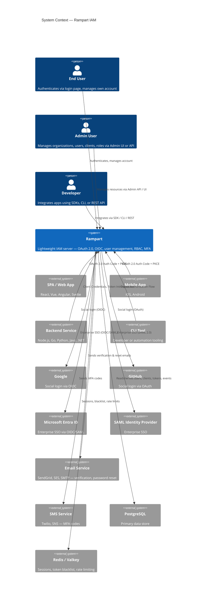

# System Context (C4 Level 1)

High-level view of Rampart and the actors that interact with it.

## Actors

| Actor | Description |
|-------|-------------|
| **End User** | Person who authenticates to access a protected application. Interacts with login/consent pages and self-service account management. |
| **Admin User** | Person who manages Rampart configuration — creates organizations, registers OAuth clients, manages users and roles. Uses Admin Dashboard UI or Admin REST API. |
| **Developer** | Person who integrates their application with Rampart using SDKs, the CLI tool, or direct REST API calls. |

## Client Applications

Rampart supports any application that speaks OAuth 2.0 / OIDC:

| Client Type | Auth Flow | Example |
|-------------|-----------|---------|
| SPA (browser) | Authorization Code + PKCE | React, Vue, Angular dashboard |
| Mobile app | Authorization Code + PKCE | iOS / Android native app |
| Backend service | Client Credentials | Microservice-to-microservice |
| CLI / IoT | Device Authorization Flow | `rampart-cli`, smart TV app |

## External Systems

| System | Purpose |
|--------|---------|
| **External IdPs** | Social login (Google, GitHub, Apple) and enterprise SSO (SAML, OIDC) |
| **Email service** | Email verification, password reset, MFA codes |
| **SMS service** | MFA OTP delivery |
| **PostgreSQL** | Primary persistent storage for all domain data |
| **Redis / Valkey** | Session storage, token blacklisting, rate limit counters |
