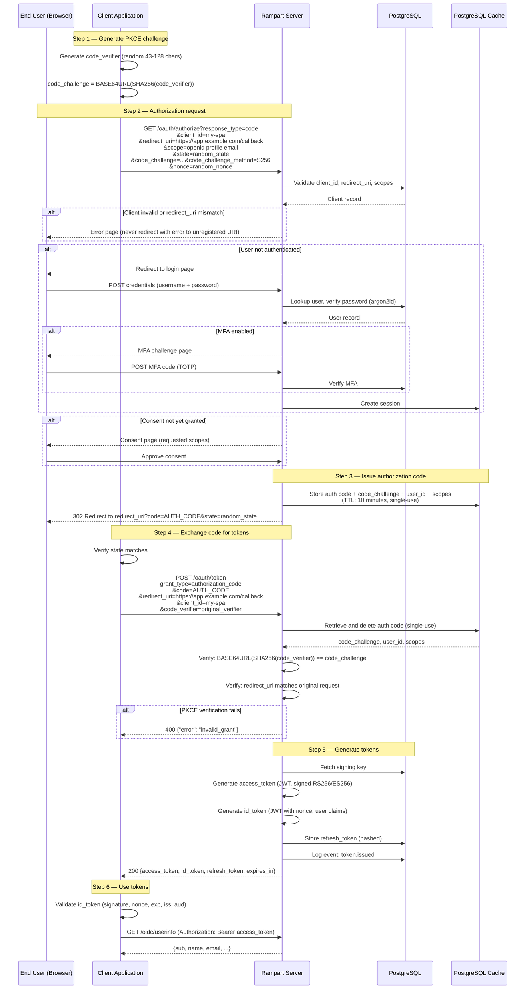

# Authorization Code Flow + PKCE

The primary authentication flow for browser-based and mobile applications. Uses PKCE (RFC 7636) to protect against authorization code interception — required for all public clients, recommended for confidential clients.

## Sequence Diagram

## Security Considerations

| Concern | Mitigation |
|---------|------------|
| Authorization code interception | PKCE with S256 required for all public clients |
| CSRF on callback | `state` parameter verified by client |
| Open redirect | `redirect_uri` must exactly match registered URI |
| Code replay | Authorization codes are single-use, deleted on first exchange |
| Code expiry | Authorization codes expire after 10 minutes |
| Token binding | `nonce` in ID token binds to the original auth request |
| Client impersonation | Confidential clients must authenticate at token endpoint |

## Parameters Reference

### Authorization Request

| Parameter | Required | Description |
|-----------|----------|-------------|
| `response_type` | Yes | Must be `code` |
| `client_id` | Yes | Registered client identifier |
| `redirect_uri` | Yes | Must exactly match a registered redirect URI |
| `scope` | Yes | Space-delimited. Include `openid` for OIDC. |
| `state` | Recommended | Random value for CSRF protection |
| `code_challenge` | Required (public) | `BASE64URL(SHA256(code_verifier))` |
| `code_challenge_method` | Required with challenge | Must be `S256` (plain not supported) |
| `nonce` | Recommended | Random value bound to ID token |
| `prompt` | Optional | `none`, `login`, `consent`, `select_account` |

### Token Request

| Parameter | Required | Description |
|-----------|----------|-------------|
| `grant_type` | Yes | `authorization_code` |
| `code` | Yes | The authorization code from step 3 |
| `redirect_uri` | Yes | Must match the original authorization request |
| `client_id` | Yes | The client identifier |
| `code_verifier` | Required (public) | The original PKCE verifier |
