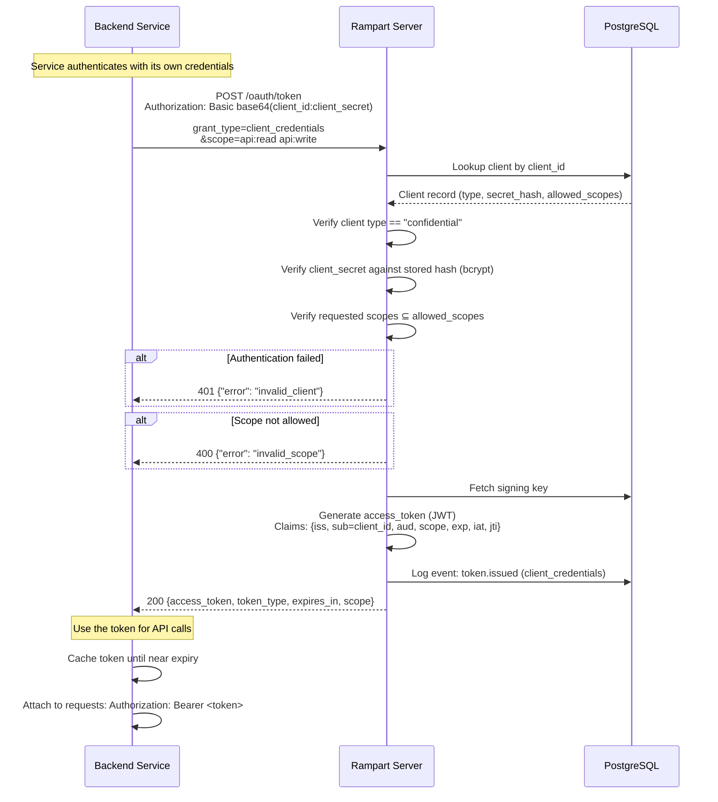

# Client Credentials Flow

Service-to-service authentication where no user is involved. The client authenticates directly with its own credentials to obtain an access token.

Used by backend services, cron jobs, microservices, and any machine-to-machine communication.

## Sequence Diagram



## Key Differences from Authorization Code Flow

| Aspect | Auth Code | Client Credentials |
|--------|-----------|-------------------|
| User involved | Yes | No |
| Client type | Public or confidential | Confidential only |
| Tokens issued | access + refresh + id_token | access only |
| Refresh token | Yes | No (just request a new token) |
| ID token | Yes (with openid scope) | No (no user) |
| `sub` claim | User ID | Client ID |

## Token Content

The access token JWT for client credentials:

```json
{
  "iss": "https://auth.example.com",
  "sub": "my-backend-service",
  "aud": "https://api.example.com",
  "scope": "api:read api:write",
  "exp": 1709500000,
  "iat": 1709496400,
  "jti": "tok_unique_id"
}
```

Note: No `name`, `email`, or user claims — there is no user in this flow.

## Client Authentication Methods

| Method | How |
|--------|-----|
| `client_secret_basic` | `Authorization: Basic base64(client_id:client_secret)` |
| `client_secret_post` | `client_id` and `client_secret` as form body parameters |
| `private_key_jwt` | Client signs a JWT assertion with its private key |

## Security Considerations

- Client secrets must be stored securely (environment variables, secret manager — never in code).
- Scopes should be narrowly defined — only grant what the service needs.
- Token lifetimes should be short (e.g., 1 hour). Services should re-request tokens rather than using long-lived ones.
- Use separate client registrations for each service — don't share credentials between services.
- Rotate client secrets periodically using the secret rotation endpoint.
