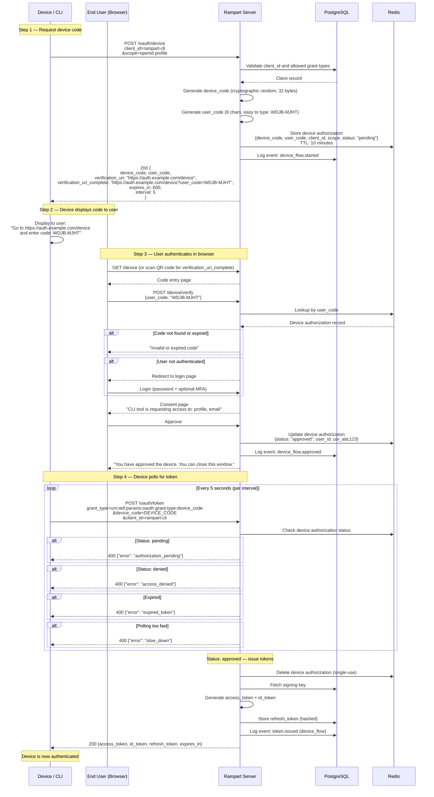

# Device Authorization Flow

Authentication for input-constrained devices that can't easily handle browser redirects — CLIs, smart TVs, game consoles, IoT devices. Follows RFC 8628.

## Sequence Diagram

## User Code Format

The user code is designed for easy typing on constrained input devices:

- 8 characters, split into two groups: `WDJB-MJHT`
- Uppercase letters only (no ambiguous characters: 0/O, 1/I/L removed)
- Character set: `BCDFGHJKMNPQRSTVWXZ` (20 characters, ~34 bits of entropy)
- Hyphen separator for readability

## Polling Behavior

| Response | Action |
|----------|--------|
| `authorization_pending` | User hasn't completed auth yet. Wait `interval` seconds and retry. |
| `slow_down` | Polling too fast. Increase interval by 5 seconds. |
| `access_denied` | User denied the request. Stop polling. |
| `expired_token` | Device code expired. Start over. |
| Token response | Success. Stop polling. |

## Security Considerations

| Concern | Mitigation |
|---------|------------|
| User code brute force | Rate limiting on code entry, limited character set size is sufficient for short-lived codes |
| Device code theft | Codes expire after 10 minutes, single-use |
| Polling abuse | `slow_down` response, rate limiting per client |
| Phishing (fake verification URI) | Users should verify the domain in their browser |
| Session fixation | User must authenticate fresh — no pre-existing session reuse |

## Use Cases

| Device | Example |
|--------|---------|
| **CLI tools** | `rampart-cli login` — developer authenticates locally |
| **Smart TVs** | Streaming app login via phone |
| **IoT devices** | Devices with no browser capability |
| **CI/CD pipelines** | Interactive auth for initial setup |
