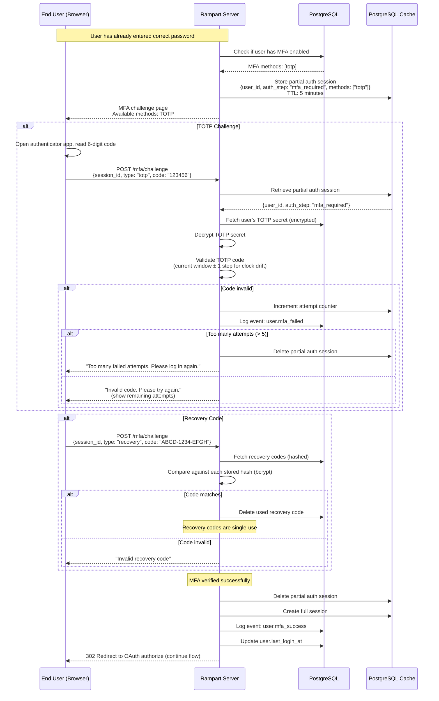
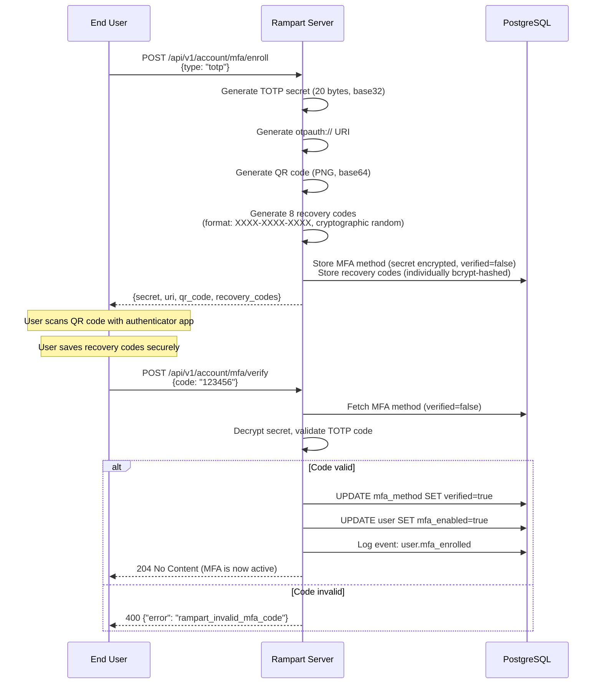

# MFA Challenge Flow

Multi-factor authentication during login. When a user has MFA enabled, they must provide a second factor after successful password verification.

## Login with MFA — Sequence Diagram

## MFA Enrollment — Sequence Diagram

## Supported MFA Methods

| Method | Status | Description |
|--------|--------|-------------|
| **TOTP** | Phase 1 | Time-based One-Time Password (RFC 6238). Works with Google Authenticator, Authy, 1Password, etc. |
| **WebAuthn / Passkeys** | Phase 2 | Hardware security keys and platform authenticators (fingerprint, face). |
| **Recovery Codes** | Phase 1 | 8 single-use backup codes for account recovery. |

## TOTP Parameters

| Parameter | Value |
|-----------|-------|
| Algorithm | SHA-1 (per RFC 6238 for compatibility) |
| Digits | 6 |
| Period | 30 seconds |
| Validation window | ±1 step (allows 30s clock drift) |
| Secret length | 20 bytes (160 bits) |

## Security Considerations

| Concern | Mitigation |
|---------|------------|
| Brute force MFA codes | Max 5 attempts per challenge session, then force re-login |
| Recovery code theft | Codes are individually bcrypt-hashed, single-use |
| TOTP secret exposure | Encrypted at rest (AES-256-GCM), shown only during enrollment |
| Replay attack | TOTP codes valid only within the current ±1 time window |
| MFA bypass | Partial auth session expires after 5 minutes |
| Account lockout | Failed MFA doesn't lock the account — but logs the event and requires re-entering password |

## Organization MFA Policies

Admins can configure MFA policy per organization:

| Policy | Behavior |
|--------|----------|
| `disabled` | MFA not available |
| `optional` (default) | Users can self-enroll via Account API |
| `required` | Users must enroll MFA. Redirected to enrollment on login if not enrolled. |
