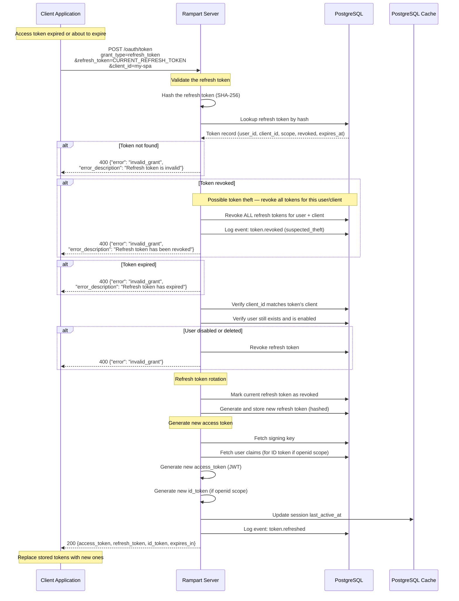

# Token Refresh Flow

Exchanges a refresh token for a new access token (and optionally a new refresh token). This allows long-lived sessions without requiring the user to re-authenticate.

## Sequence Diagram



## Refresh Token Rotation

Rampart implements **refresh token rotation** as a security best practice:

1. Every time a refresh token is used, it is **invalidated** and a **new refresh token** is issued.
2. If a previously-used (revoked) refresh token is presented, Rampart treats this as **token theft** and revokes the entire token family.

This limits the damage of a leaked refresh token — an attacker can use it at most once before the legitimate client's next refresh detects the theft.

```
Refresh #1: RT_A → issues RT_B (RT_A marked revoked)
Refresh #2: RT_B → issues RT_C (RT_B marked revoked)

If attacker uses RT_A again:
  → RT_A is already revoked → THEFT DETECTED
  → ALL tokens (RT_B, RT_C) revoked
  → User must re-authenticate
```

## Token Lifetimes

| Token | Default Lifetime | Configurable |
|-------|-----------------|--------------|
| Access token | 15 minutes (900s) | Yes, via `RAMPART_ACCESS_TOKEN_TTL` |
| Refresh token | 7 days (604800s) | Yes, via `RAMPART_REFRESH_TOKEN_TTL` |
| ID token | Same as access token | Yes |

## Security Considerations

| Concern | Mitigation |
|---------|------------|
| Refresh token theft | Token rotation — each token is single-use |
| Replay of old token | Revokes entire token family on reuse detection |
| Stolen token window | Short access token lifetime limits exposure |
| Disabled user | User status checked on every refresh |
| Client mismatch | Refresh token is bound to the issuing client |

## Error Responses

| Scenario | Error Code | Description |
|----------|-----------|-------------|
| Token not found | `invalid_grant` | The token doesn't exist |
| Token revoked | `invalid_grant` | Token was already used (rotation) or explicitly revoked |
| Token expired | `invalid_grant` | Past the token's expiration time |
| User disabled | `invalid_grant` | The user account has been disabled |
| Wrong client | `invalid_grant` | Token was issued to a different client |
