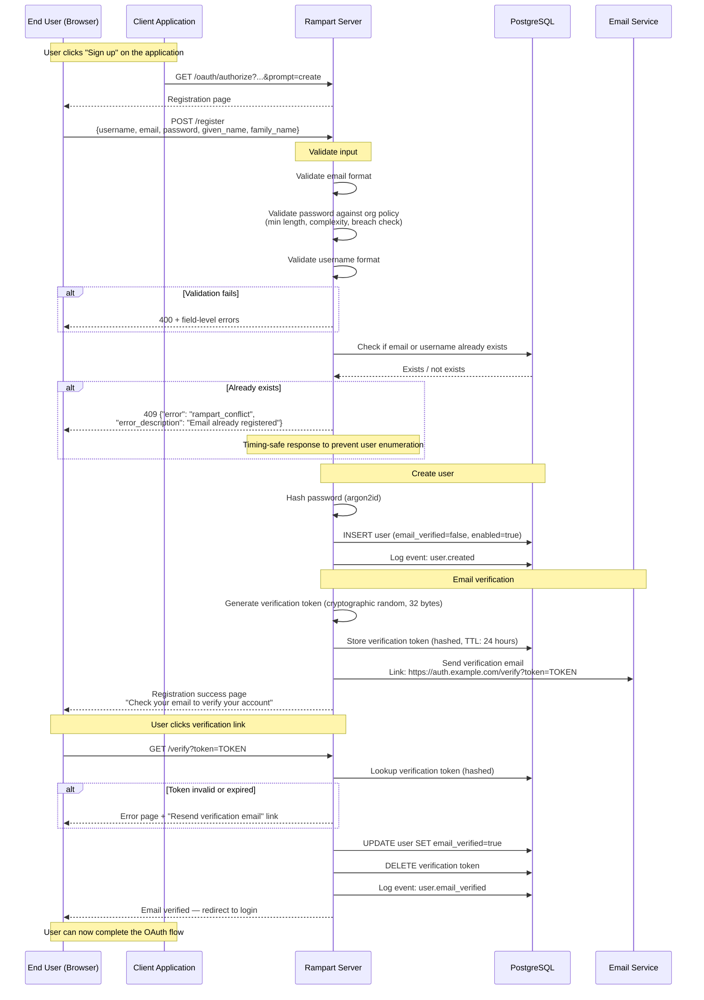
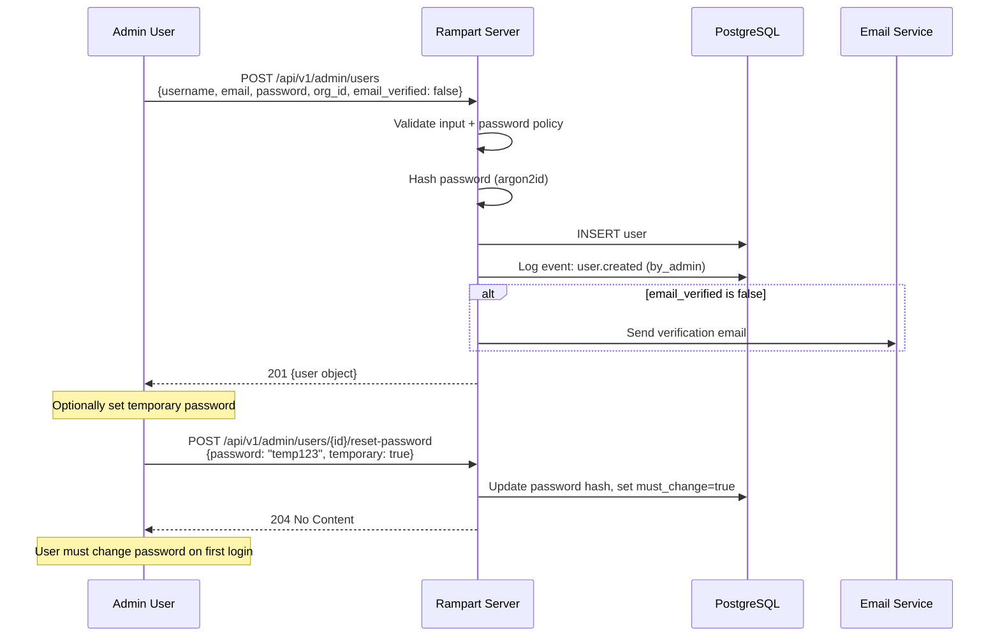

# User Registration Flow

New user self-registration with email verification. Registration can be initiated via the login page or directly through the Admin API.

## Self-Registration Sequence

## Admin-Created User

Admins can create users directly via the API. These users may bypass email verification if the admin marks `email_verified: true`.

## Password Policy Enforcement

The registration flow enforces the organization's password policy:

| Rule | Default | Configurable |
|------|---------|--------------|
| Minimum length | 12 characters | Yes |
| Require uppercase | Yes | Yes |
| Require number | Yes | Yes |
| Require special character | Yes | Yes |
| Breached password check | Yes (via k-anonymity API) | Yes |
| Password history | Last 5 passwords | Yes |

## Anti-Abuse Measures

| Threat | Mitigation |
|--------|------------|
| User enumeration | Timing-safe responses — same latency for "exists" and "not exists" |
| Registration spam | Rate limiting on registration endpoint |
| Email bombing | Rate limit on verification emails per address |
| Weak passwords | Password policy enforcement + breached password check |
| Bot registration | CAPTCHA integration point (pluggable) |
